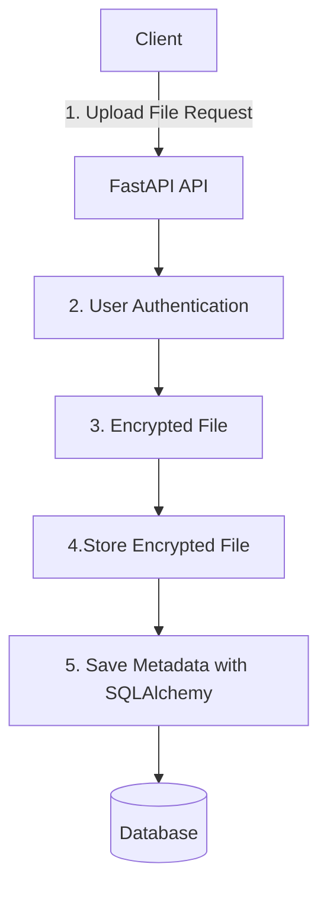

# Secure-file-storage-API
A secure API for encrypted file storage built with FastAPI. The system allows for users to upload, download and manage files through encryption and access controls. Key Features: -Encrypted file storage - Password hashing - Authenticated user access - User based file access.

Technologies Used:
Python
FastAPI
SQLAlchemy
JWT Authentication
bcrypt
cryptography
SQLite / PostgreSQL

Architecture: (what happend when a client uploads a file)

Instalation Instructions

git clone "" paste URL for repository""
cd secure-file-storage-api

python -m venv .venv
.venv\Scripts\activate

pip install -r requirments.txt

Run the Server
uvicorn app.main:app --reload
Open:
http://127.0.0.1:8000/docs

Security Features
  - password hashing using bcrypt
  - JWT authentication
  - Encrypted file storage
  - User ownership validation
  - Secure API endpoints

