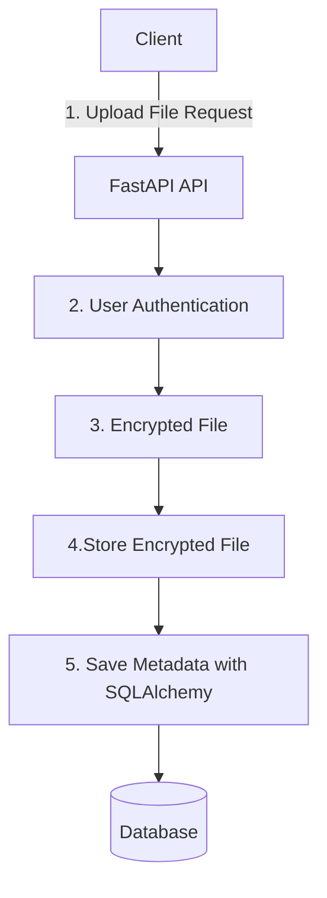

# Secure-file-storage-API
A secure API for encrypted file storage built with FastAPI. The system allows for users to upload, download and manage files through encryption and access controls. Key Features: -Encrypted file storage - Password hashing - Authenticated user access - User based file access.

Technologies Used:
Python
FastAPI
SQLAlchemy
JWT Authentication
bcrypt
cryptography
SQLite / PostgreSQL

Architecture: (what happend when a client uploads a file)

```mermaid
flowchart TB
  A[Client]-->| 1. Upload File Request| B[FastAPI API]
  B--> C[2. User Authentication]
  C --> D[3. Encrypted File]
  D --> E[4.Store Encrypted File]
  E --> F[5. Save Metadata with SQLAlchemy]
  F --> G[(Database)]
```
Instalation Instructions

git clone "" paste URL for repository""
cd secure-file-storage-api

python -m venv .venv
.venv\Scripts\activate

pip install -r requirments.txt

Run the Server
uvicorn app.main:app --reload
Open:
http://127.0.0.1:8000/docs

Security Features
  - password hashing using bcrypt
  - JWT authentication
  - Encrypted file storage
  - User ownership validation
  - Secure API endpoints

# Running Tests

This project uses pytest for autometed testing. The tests cover models, authentication, encryption, file validation, and the full set of API endpoints.

Setup:
Install pytest
Command:
pip install pytest

Running all tests:
Command;
pytest tests/ -v

The -v flag shows each test name and if it passes of failed, rather than a summart count

Runniong Specific tests:
Command:
pytest tests/test_files.py -v

Test files:
| File | Covers |
| --- | --- |
| test_models.py | User and File database models, relationships, constraints |
| test_auth.py | Password hashing, JWT creation/ verification, get_current_user |
| test_endpoints.py | /register and /login endpoints |
| test_encryption.py | AES file encryption and decryption |
| test_upload.py | File validation (size, extension, content signiture) and POST/files/upload |
| test_files.py | GET /files, GET /files/{id}, DELETE /files/{id}, including cross-user ownership checks |
